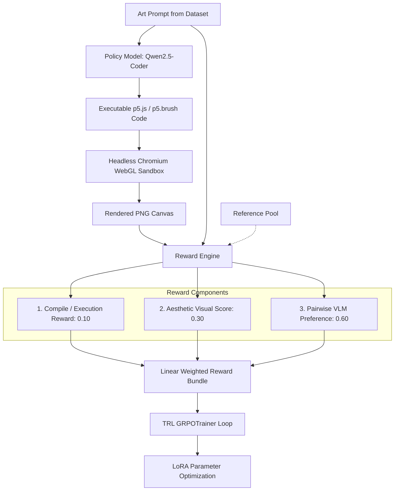

# Training AI to Paint with Code (`paint-code-rl`)

> A research platform for training language models to generate executable generative art programs (`p5.js` / `p5.brush`) using reinforcement learning (GRPO) and visual preference rewards.

---

## Project Status

```text
STATUS:
Phase-0 research prototype

Architecture:
HARDENED & VALIDATED

Scientific validation:
READY FOR EXPERIMENTATION

CUDA validation:
PENDING KAGGLE

MPS validation:
VERIFIED ON APPLE SILICON M4 (1-step GRPO + Metal WebGL Rendering)

CPU:
DEVELOPMENT / SMALL-MODEL EXPERIMENTATION
```

> [!IMPORTANT]
> **Scientific Integrity Notice:** The causal claim that pairwise visual judging solves mode collapse in code-based art generation has **not** been independently established by this repository yet. This platform is the experimental instrument constructed to rigorously test that hypothesis.

---

## Architecture Overview



---

## Execution Modes & Safety Guarantees

| Mode | External APIs Allowed | GPU Hardware Constraint | Default Target | Purpose |
|------|----------------------|-------------------------|----------------|---------|
| `DRY_RUN` | **BLOCKED** | CPU only / Mock | `cpu` | Smoke-test pipeline orchestration with zero model loading |
| `FREE` | **BLOCKED** | Free Kaggle 2x T4 GPUs | `cuda:0` / `cuda:1` | Zero-cost multi-GPU validation |
| `LOCAL` | **BLOCKED by default** | Apple Silicon M4 / Local PC | `mps` / `cuda` / `cpu` | On-device training without cloud API dependencies |
| `PAID` | Allowed if explicitly configured | Cloud GPU (A100 / RTX 4090) | `cuda:0` | High-throughput scaled training with frontier VLMs |

---

## Quick Start & Installation

### 1. Clone the Frozen Release
```bash
git clone https://github.com/harshitthek/paint-code-rl.git
cd paint-code-rl
git checkout v0.1.0-phase0
```

### 2. Environment Setup
```bash
# Python Environment (3.10 or 3.11)
python3 -m venv .venv
source .venv/bin/activate  # On Windows: .venv\Scripts\activate
pip install -e ".[dev]"

# Node.js Renderer Runtime
cd renderer
npm install
cd ..
```

### 3. Run Automated Tests
```bash
# Full test suite (35 unit + config + reward + dataset tests)
python -m pytest tests/ -v

# Renderer security smoke tests and 10-sketch visual corpus
cd renderer
node test_security.js
node test_corpus.js
cd ..
```

---

## Hardware Validation Commands

### A. Local CPU Development & Smoke Testing
```bash
# Probe compute capability
python scripts/benchmark.py

# Run all unit tests
python -m pytest tests/ -v

# 1-Step CPU sanity check (uses 0.5B model)
python scripts/train_grpo.py --mode one_step
```

### B. Apple Silicon M4 (MPS) Hardware Validation
```bash
# Run Apple Silicon memory feasibility and tensor benchmark
python scripts/mps_validation_suite.py

# Generate baseline samples with Qwen2.5-Coder-1.5B on MPS
python scripts/generate_baseline.py --num-samples 3 --output-dir artifacts/baseline_m4

# Execute 1 physical GRPO step on Apple Silicon
python scripts/train_grpo.py --mode one_step
```

### C. Kaggle 2x T4 GPU Hardware Validation
In a Kaggle Notebook with **GPU T4 x 2** accelerator:
1. Open `notebooks/Phase0_Kaggle_Validation.ipynb`.
2. Run all cells or execute:
   ```bash
   python scripts/kaggle_validation_driver.py
   ```

---

## Deployment Documentation

Detailed deployment guides are available in [`docs/deployment/`](file:///docs/deployment/):
* [`CPU.md`](file:///docs/deployment/CPU.md) — CPU development and smoke test sequence
* [`M4_MPS.md`](file:///docs/deployment/M4_MPS.md) — Apple Silicon M4 physical validation sequence
* [`KAGGLE.md`](file:///docs/deployment/KAGGLE.md) — Kaggle 2x T4 multi-GPU driver workflow
* [`PAID_CLOUD.md`](file:///docs/deployment/PAID_CLOUD.md) — Docker and cloud GPU deployment (RunPod/Lambda)

---

## Scientific Roadmap

* **Phase 0 (Current):** Infrastructure, WebGL rendering, cost guard, and multi-backend hardware validation.
* **Phase 1:** Reward validation and visual preference scoring fidelity.
* **Phase 2:** Controlled ablation: Pairwise VLM preference vs. Pointwise scalar score.
* **Phase 3:** Static reference pool anchoring experiments.
* **Phase 4:** Reward model distillation into lightweight local reward models.
* **Phase 5:** Multi-step long-horizon training and curriculum scaling.

---

## Known Limitations

1. **Hardware Constraints:** 16GB Apple Silicon Macs are memory-constrained. While `1.5B Policy + 2B VLM` runs sequentially, simultaneous 7B model loading requires 24GB+ VRAM.
2. **Deterministic WebGL:** Headless WebGL2 rendering is perceptually consistent across identical OS/GPU builds, but minor antialiasing variances can occur across different GPU vendors.
3. **No Target Programs:** Dataset contains only natural language prompts; the policy must discover executable generative code purely through reinforcement learning.

---

## License

MIT License. See [LICENSE](LICENSE) for details.
