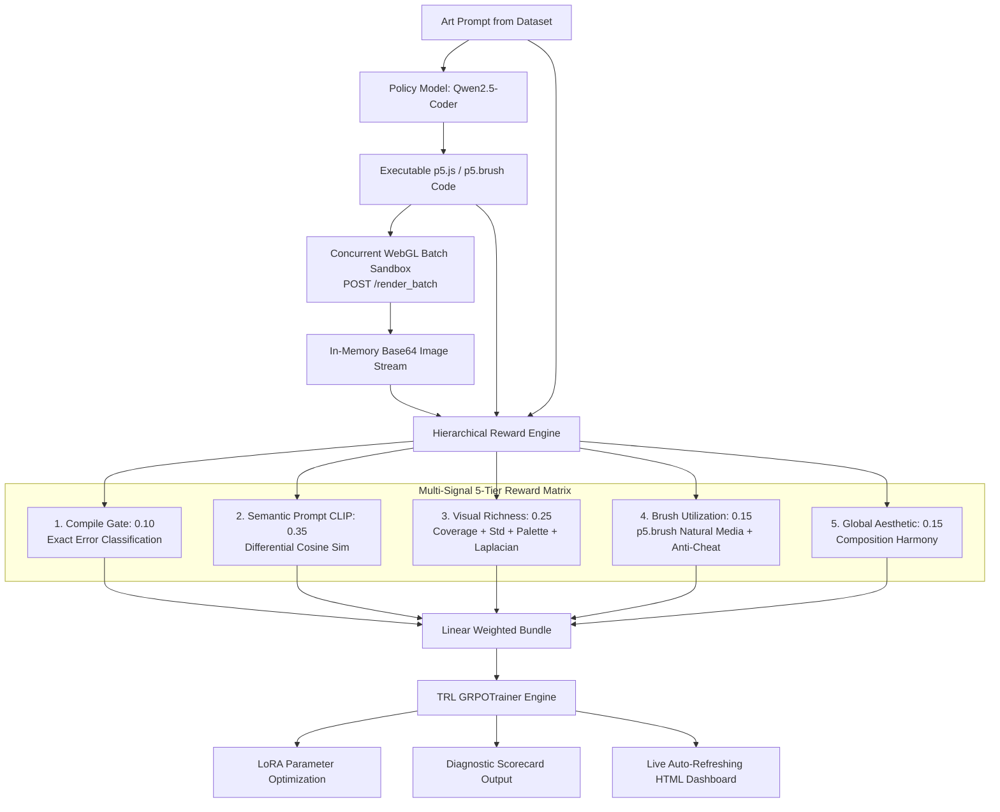

# Training AI to Paint with Code (`paint-code-rl`)

[](https://github.com/harshitthek/paint-code-rl/releases)
[](https://huggingface.co/HarshittheK/paint-code-rl-lora)
[](https://www.kaggle.com/code)
[-brightgreen.svg)](TEST_STATUS.md)
[](LICENSE)
[](pyproject.toml)

> A research platform for training language models to generate executable generative art programs (`p5.js` / `p5.brush`) using reinforcement learning (GRPO), a 5-tier verifiable visual reward matrix, and interactive cyclic continuous training.

---

## 📖 About

`paint-code-rl` is an open-source research platform investigating a central challenge in creative artificial intelligence: **Can a code-generation language model learn to create authentic, compelling visual art using reinforcement learning from verifiable visual feedback?**

### Why Code-Based Art Over Pixel Diffusion?
* **Infinite Resolution & Vector Scaling**: Unlike diffusion models that output fixed-dimension raster grids, code written in `p5.js` and `p5.brush` is resolution-independent, mathematically precise, and vector-scalable.
* **Parametric & Interactive**: Artists can directly edit seeds, brush textures, flow fields, and color palettes after generation, or animate them in real-time WebGL canvas viewports.
* **Compact & Interpretable**: An entire complex artwork is represented in fewer than 200 lines of human-readable JavaScript rather than multi-gigabyte pixel tensors.

### The Problem: Syntax Validity vs. Visual Quality
Standard code models frequently generate programs that compile without syntax errors but produce visually degenerate outputs — empty canvases, single unrendered pixels, or microscopic black dots. Text-only loss functions and conventional unit tests cannot distinguish between a blank screen and an intricate watercolor landscape.

### How `paint-code-rl` Solves It
1. **Sandboxed Headless WebGL Execution**: An ephemeral Puppeteer daemon executes generated p5.js scripts with WebGL2/SwiftShader acceleration, streaming rendered canvas buffers into in-memory image pipelines.
2. **5-Tier Verifiable Visual Reward Matrix**: Computes composite multi-signal rewards evaluating compile success, CLIP semantic alignment, edge richness via Laplacian variance ($\nabla^2 I$), natural media brush mechanics, and aesthetic harmony with anti-cheat filters.
3. **Group Relative Policy Optimization (GRPO)**: Directly trains policy models (e.g. Qwen2.5-Coder) with mathematical group advantage normalization, eliminating the memory overhead of a separate critic network.
4. **Interactive Cyclic Continuous Training**: Supports human-in-the-loop training with dynamic temperature annealing ($T=0.85 \rightarrow 0.55$), multi-GPU hardware saturation (`--max`), explainable scorecards, and an auto-refreshing live HTML dashboard.

---

## 🌟 Project Status

```text
STATUS:
Phase-0 Research Prototype — Production Hardened & Multi-Signal Shaped

Test Coverage:
148/148 TESTS PASSING (100% GREEN)
  - 107 Python Unit, Integration, Hardening & Telemetry Tests (pytest)
  - 10 Node.js Sandbox Security Smoke Tests (npm test)
  - 10 WebGL / p5.brush Visual Corpus Tests (node renderer/test_corpus.js)
  - 21 WebGL Adversarial Stress Tests (node renderer/test_adversarial_corpus.js)

Hardware Targets:
  - Apple Silicon M4 (16GB+): Physical MPS & Metal WebGL validation verified
  - Kaggle Dual GPU (2x Tesla T4): Multi-GPU cloud driver ready (notebooks/kaggle_paint_rl.ipynb)
  - Local CPU / CI: Verified 100% functional fallback
```

> [!IMPORTANT]
> **Scientific Integrity Notice:** The causal claim that pairwise visual judging solves mode collapse in code-based art generation has **not** been independently established by this repository yet. This platform is the experimental instrument constructed to rigorously test that hypothesis.

---

## 🏛 Architecture Overview



---

## ⚡ Quick Start & Installation

### 1. Clone the Repository
```bash
git clone https://github.com/harshitthek/paint-code-rl.git
cd paint-code-rl
```

### 2. Environment Setup
```bash
# Python Virtual Environment (3.10 or 3.11)
python3 -m venv .venv
source .venv/bin/activate  # On Windows: .venv\Scripts\activate
pip install -e ".[dev]"

# Node.js Renderer Runtime
cd renderer
npm install
cd ..
```

### 3. Run Automated Tests
```bash
# Full Python test suite (107 pytest tests: unit, rewards, edge cases, numerical hardening)
python -m pytest tests/ -v

# Renderer security smoke tests (10 tests), visual corpus (10 tests), and adversarial stress suite (21 tests)
cd renderer
npm test
node test_corpus.js
node test_adversarial_corpus.js
cd ..
```

---

## 🎨 Interactive Cyclic Continuous Training

Run reinforcement learning in discrete, human-in-the-loop cycles with live diagnostic scorecards and hardware resource saturation:

```bash
# 1. Interactive cyclic continuous training with live dashboard & saturated hardware
python scripts/train_grpo.py --mode train --steps-per-cycle 25 --max --dashboard

# 2. Unattended continuous training (Kaggle / Cloud GPU headless mode)
python scripts/train_grpo.py --mode train --steps-per-cycle 50 --max-steps 500 --unattended --max

# 3. 1-Step hardware validation sanity check
python scripts/train_grpo.py --mode one_step

# 4. Generate artwork gallery & evaluate model checkpoints
python scripts/generate_and_render.py --model Qwen/Qwen2.5-Coder-1.5B-Instruct --checkpoint-dir artifacts/checkpoints --max
```

### Key CLI Flags:
* `--steps-per-cycle <int>`: Number of training steps executed per interactive feedback cycle (default: 25).
* `--max`: Automatically probes system RAM, CPU cores, and GPU VRAM, saturating thread pools and expanding group sizes ($G=4 \rightarrow 6/8$) and token budgets.
* `--dashboard`: Launches and continuously updates `artifacts/dashboard.html` with real-time Chart.js loss/temperature curves and rendered artwork gallery.
* `--unattended`: Runs continuously without interactive prompts for headless cloud runs.

---

## 📊 Live HTML Visual Dashboard

When `--dashboard` is enabled during training, open `artifacts/dashboard.html` in any browser:
* **Real-time Trajectories:** Visualizes training loss alongside dynamic exponential temperature annealing ($T=0.85 \rightarrow 0.55$).
* **Artwork Gallery:** Inspect latest generated artworks, reward breakdowns, and p5.js source code.
* **Auto-Refresh:** Updates automatically every 10 seconds.

---

## 🚀 Hub Models & Cloud Workflows

| Platform | Resource | Link / Handle | Description / Usage |
| :--- | :--- | :--- | :--- |
| **Hugging Face** | Model Weights | [`HarshittheK/paint-code-rl-lora`](https://huggingface.co/HarshittheK/paint-code-rl-lora) | Auto-downloaded by `scripts/generate_and_render.py` |
| **Kaggle Notebooks** | 1-Click Dual-GPU Training | [`notebooks/kaggle_paint_rl.ipynb`](notebooks/kaggle_paint_rl.ipynb) | Dual Tesla T4 training with full hardware saturation |
| **Kaggle Models** | Model Checkpoint | [`pernavjain/paint-code`](https://www.kaggle.com/models) | Downloadable via `kagglehub.model_download()` |
| **GitHub Releases** | Source & Release Bundles | [Releases](https://github.com/harshitthek/paint-code-rl/releases) | Stable releases, tags, and changelogs |

### Download & Evaluate Pretrained Weights
```bash
# Auto-download from Hugging Face and render art gallery
python scripts/generate_and_render.py --model Qwen/Qwen2.5-Coder-1.5B-Instruct --max

# Or download from Kaggle Models via KaggleHub
python scripts/generate_and_render.py --kagglehub pernavjain/paint-code/pyTorch/default
```

### Publish Checkpoints to Hubs
```bash
# Publish to Hugging Face Hub (requires HF_TOKEN)
python scripts/upload_model.py --checkpoint artifacts/checkpoints/checkpoint-50 --hf-repo HarshittheK/paint-code-rl-lora

# Publish to Kaggle Models via KaggleHub (requires KAGGLE_USERNAME & KAGGLE_KEY)
python scripts/upload_model.py --checkpoint artifacts/checkpoints/checkpoint-50 --kaggle-handle HarshittheK/paint-code
```

---

## 📚 Complete Documentation Index

### Architecture & System Design
- [System Architecture Specification](docs/architecture/SYSTEM_ARCHITECTURE.md) — Comprehensive end-to-end subsystem specifications and dataflows.
- [Adversarial Red-Team & Architecture Synthesis](docs/research/ARCHITECTURAL_REDTEAM_AND_SYNTHESIS.md) — Analysis of 5 naive anti-patterns and battle-tested solutions.
- [Test Status & Verification Report](TEST_STATUS.md) — 148-test verification breakdown.
- [Final Implementation Status](FINAL_IMPLEMENTATION_STATUS.md) — Component status and verification matrix.

### Architecture Decision Records (ADRs)
- [ADR-001: Headless Chromium WebGL Architecture](docs/decisions/ADR-001-puppeteer-webgl.md)
- [ADR-002: Managing Stochasticity and GPU Seeding](docs/decisions/ADR-002-stochasticity.md)
- [ADR-003: Standalone Lightweight Implementation (De-vendor SOUP)](docs/decisions/ADR-003-soup-dependency.md)
- [ADR-004: Execution Modes and Cost Safety Guarantees](docs/decisions/ADR-004-execution-modes.md)
- [ADR-005: Pinned TRL & HuggingFace Dependencies](docs/decisions/ADR-005-trl-pin.md)
- [ADR-006: Deferred In-Memory Browser Page Pooling](docs/decisions/ADR-006-deferred-refresh.md)
- [ADR-007: Deferred Multi-Node Distributed Training](docs/decisions/ADR-007-deferred-distributed.md)
- [ADR-008: Multi-Signal Visual RL and Ephemeral Sandboxing](docs/decisions/ADR-008-multimodal-visual-rl-and-sandboxing.md)
- [ADR-009: Interactive Cyclic Training, Scorecards & Hardware Saturation](docs/decisions/ADR-009-interactive-cyclic-training-and-hardware-saturation.md)

### User & Deployment Guides
- [User Guide: Interactive Cyclic Training & Scorecards](docs/user_guide/INTERACTIVE_CYCLIC_TRAINING.md) — Step-by-step training and scorecard guide.
- [Apple Silicon M4 Deployment Guide](docs/deployment/M4_MPS.md) — Native Metal ANGLE acceleration and MPS memory management.
- [Kaggle 2x T4 GPU Deployment Guide](docs/deployment/KAGGLE.md) — Zero-cost cloud driver setup and Jupyter notebook workflow.
- [Local CPU Development Guide](docs/deployment/CPU.md) — Fast unit testing and functional validation.
- [Cloud GPU Deployment Guide](docs/deployment/PAID_CLOUD.md) — Docker and high-throughput A100 setups.

---

## ⚖ License

MIT License. See [LICENSE](LICENSE) for details.
