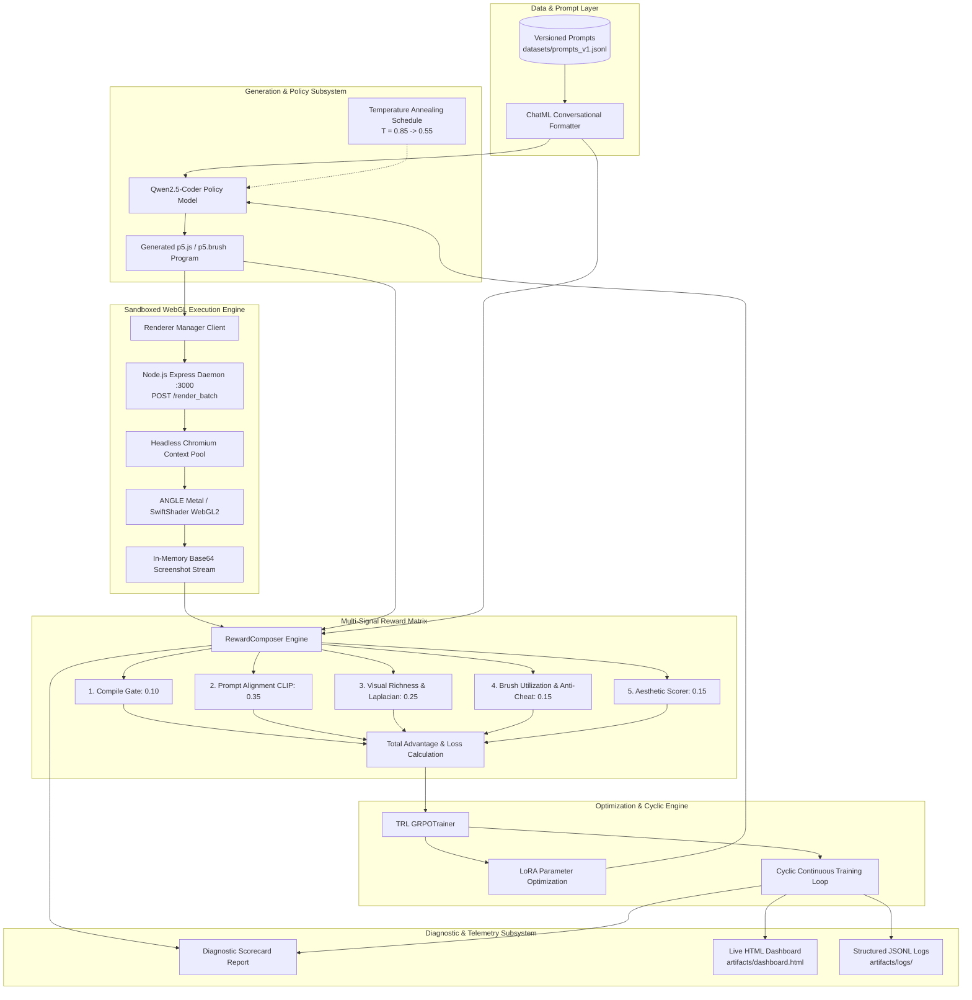
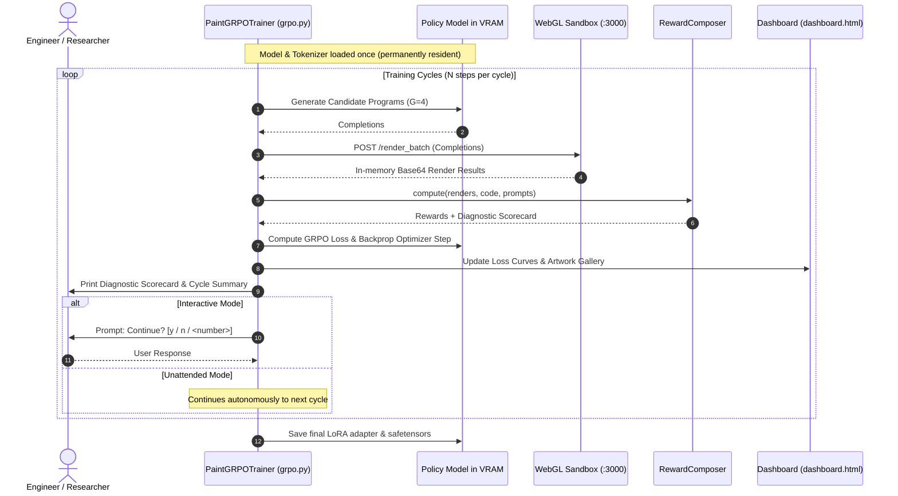

# System Architecture Specification

> Complete architectural reference for the `paint-code-rl` generative art reinforcement learning platform.

---

## 1. High-Level System Architecture

---

## 2. Core Subsystems

### A. Policy & Generation Subsystem
* **Model Selection:** Automatically selects target model based on available hardware:
  * `Apple Silicon (MPS):` `Qwen/Qwen2.5-Coder-1.5B-Instruct` (FP32, LoRA rank $r=8$)
  * `NVIDIA CUDA (>= 20GB):` `Qwen/Qwen2.5-Coder-7B-Instruct`
  * `CPU Development:` `Qwen/Qwen2.5-Coder-0.5B-Instruct`
* **Sliding Window Clean Setup:** Injected `sliding_window = None` at `AutoConfig` level to prevent sliding window attention mismatch warnings.
* **Temperature Annealing:** Controlled by `PaintGRPOTrainer.compute_temperature(step)`:
  $$\text{Temperature}(\text{step}) = 0.55 + 0.30 \cdot \exp\left(-\frac{\text{step}}{100}\right)$$

### B. Sandboxed WebGL Execution Engine
* **Technology:** Node.js Express server (`renderer/server.js`) hosting Puppeteer Chromium sandboxes (`renderer/sandbox.js`).
* **GPU Acceleration:**
  * macOS: Native Metal GPU rasterization via `--use-gl=angle` and `--use-angle=metal`.
  * Linux / Windows: SwiftShader software rasterizer via `--use-gl=angle` and `--use-angle=swiftshader-webgl`.
* **Security & Isolation:**
  * Outbound network exfiltration blocked via request interception (`page.setRequestInterception(true)`).
  * Path traversal blocked by strict `runId` sanitization.
  * Signal tampering prevented by immutable `Object.defineProperty(window, 'signalRenderComplete', ...)`.
  * Guaranteed ephemeral page closure and temporary file unlinking in `finally` blocks.

### C. 5-Tier Verifiable Visual Reward Matrix
Every candidate generation is evaluated across 5 non-hackable visual and structural criteria:

| Tier | Component | Weight | Metric Formula & Function |
| :--- | :--- | :--- | :--- |
| **1** | **Compile Gate** | `0.10` | Binary $0/1$ render verification with exact error classification (`TIMEOUT`, `PARSE_ERROR`, `NO_CANVAS`, `RUNTIME_ERROR`). |
| **2** | **Prompt Alignment** | `0.35` | Differential CLIP cosine similarity calibrated against negative blank anchors: $\Delta = \text{sim}(\text{prompt}) - \text{sim}(\text{blank})$. |
| **3** | **Visual Richness** | `0.25` | $0.30 \cdot \text{Coverage} + 0.25 \cdot \text{Std} + 0.20 \cdot \text{PaletteEntropy} + 0.25 \cdot \text{Laplacian}(\nabla^2 I)$. |
| **4** | **Brush Utilization** | `0.15` | Structured p5.brush media detector (`scaleBrushes`, `brush.fill`, `wash`, `bleed`) + instant zero-reward penalty on `text()` cheat attempts. |
| **5** | **Global Aesthetic** | `0.15` | Composition balance and harmony evaluated via `CLIPAestheticScorer` / `ImageReward`. |

---

## 3. Interactive Cyclic Continuous Training

---

## 4. Hardware Sizing & Scaling Matrix

| Platform | Compute Device | Precision | Default Group ($G$) | `--max` Group ($G$) | Max Completion Tokens |
| :--- | :--- | :--- | :--- | :--- | :--- |
| **Apple Silicon M4 (16GB)** | `mps` (Metal) | `float32` | $4$ | $6$ | $448$ |
| **Apple Silicon M4 Max (32GB+)** | `mps` (Metal) | `float32` | $4$ | $8$ | $512$ |
| **Kaggle Dual Tesla T4 (30GB)** | `cuda:0` / `cuda:1` | `float16` | $4$ | $6$ | $450$ |
| **Cloud A100 GPU (40GB/80GB)** | `cuda` | `bfloat16` | $4$ | $8$ | $512$ |
| **Local PC / CI Environment** | `cpu` | `float32` | $2$ | $2$ | $256$ |

---

## 5. Architectural Documents & ADR Links
- [ADR-001: Headless Chromium WebGL Architecture](docs/decisions/ADR-001-puppeteer-webgl.md)
- [ADR-008: Multi-Signal Visual RL & Sandboxing](docs/decisions/ADR-008-multimodal-visual-rl-and-sandboxing.md)
- [ADR-009: Interactive Cyclic Training & Hardware Saturation](docs/decisions/ADR-009-interactive-cyclic-training-and-hardware-saturation.md)
- [Architectural Red-Team Analysis & Synthesis](docs/research/ARCHITECTURAL_REDTEAM_AND_SYNTHESIS.md)
